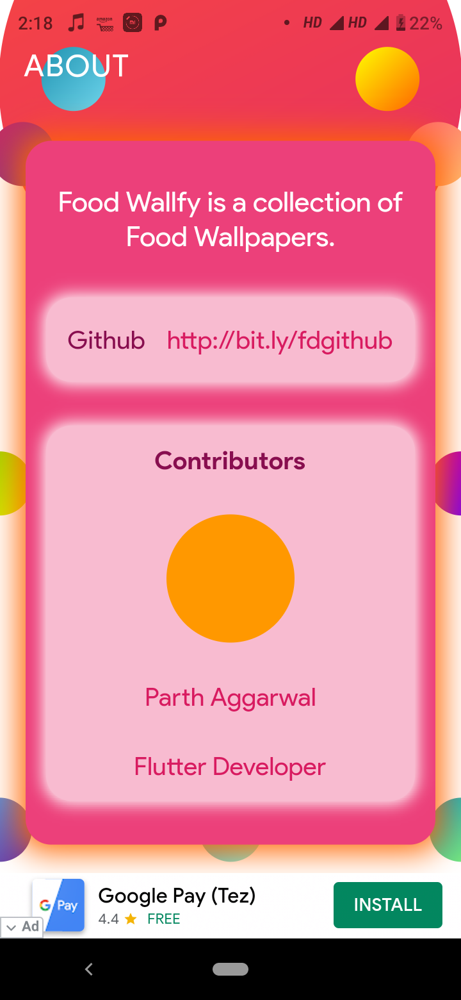

# Food Wallfy

   

Food Wallfy is a collection of food images.

# Flutter Packages used by the app

```yaml
cupertino_icons:
dio:
sqflite:
connectivity:
rxdart:
flutter_spinkit:
shared_preferences:
cached_network_image:
flutter_staggered_grid_view:
path_provider:
esys_flutter_share:
permission_handler:
file_utils:
package_info:
wallpaper:
fluttertoast:
firebase_analytics:
in_app_purchase:
firebase_admob:
firebase_crashlytics:
firebase_performance:
```

# Dart version

```yaml
sdk: ">=2.2.0 <3.0.0"
```

# Running a project

```console
git clone https://github.com/FrazileDevelopers/FoodWallfy
flutter run
```

# Build a release apk

```console
git clone https://github.com/FrazileDevelopers/FoodWallfy
flutter build apk --release
```

# Screenshots

## Home Screen


## Full Screen


## About Screen



<!-- # ☕️ Donate
<a href="https://www.buymeacoffee.com/Frazile" target="_blank"></a> -->

# Copyright Claim

Copyright © 2020, [FoodWallfy](https://github.com/FrazileDevelopers/FoodWallfy).
Released under the [MIT License](LICENSE).

<!-- Encryption

```shell
openssl enc -aes-256-cbc -e -in google-services.json -out google-services.fz
```

Decryption

```shell
openssl enc -aes-256-cbc -d -in google-services.json -out google-services.fz
``` -->
